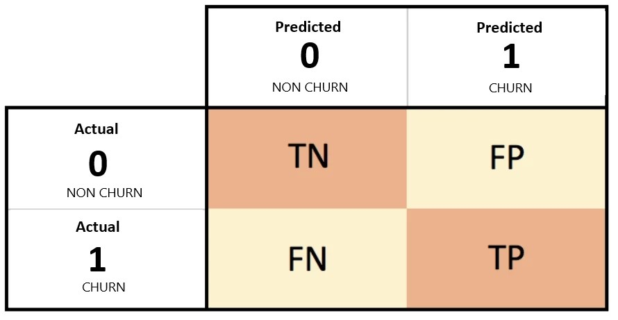

# **Customer Retention Analytic: Telco Customer Churn**
#### Created By : Reyhan Alif Pradityo

This is a machine learning project intended as a requirement for Capstone Project Module 3 in Purwadhika Data Science course. The outcome of this project is to demonstrate student ability to create a machine learning model, but not only to create, but the student need to have a clear understanding about the problem, the targets needed to achieve, limitation of the model, and finally giving the correct conclusion and recommendation.  

---

## Business Problem Understanding

**Context**

In this project, we work as a Data Scientist in an X Telco Company. X Telco Company provides home phone and internet services. The most crucial thing in telecom industry is to retain existing customer. Due to telecom industry competition, it is easy for the customers to choose from variety provider and switch from to another provider. Because of that, the telecommunications business usually has an annual churn rate of 15-25% [[1]](https://www.smartlook.com/blog/customer-churn-retention/).

The problem that company face to retain individual customer is due to large number of customer, Costumer Solution Division don't have enough resource and time to handle each of the customer. The cost would be too great if they have to deal with every single customer and convince them to keep using the company products. 

To deal with that problem, we need to predict which customer that has high churn potentional, so we could spend our precious resource to deal with those specific customer.  

But why retaining current customer is so important? why don't the company just focus to attract more customer instead of spending resource to retain them? Because it is much less expensive to retain existing customers than it is to acquire new customers. That's why customer churn metric is really important in telecom industry [[2]](https://www.europeanbusinessreview.com/is-acquiring-new-customers-more-expensive-than-keeping-them/).

What we want to do next as a Data Scientist in X Telco Company is to create a Machine Learning Model to predict which customer that has high risk of churn in the next billing cycle. 

Target :

0 : Non-Churn Customer 

1 : Churn Customer

**Why We Should use ML in this Project**

Utilizing Machine Learning in Business is usually expensive and some problems maybe don't need machine learning model considering the profit it could generate to cover the cost of utilizing machine learning. 

*So why we need to use Machine Learning to solve the problem in this project?*

The volume of data we need to analyze from telco customer is big [[3]](https://www.elinext.com/industries/telecom/big-data-in-telecom/). We need to have the churn prediction ready every month and right after every billing cycle ends. So the possible way to achieve that is by utilizing Machine Learning. 

*Will the cost saved from retaining customer through this solution could cover the cost of utilizing Machine Learning?*

That's what we are going to find out in this project, right after we could determine our machine learning model, we will find out wether the cost saved could cover the cost or not.

**Goals**

The goal of this project is to create a Machine Learning model that could be used to predict Churn Customer in the next billing cycle. We will use Telco Customer Churn dataset from X Telco Company as a base to train the model. 

The Machine Learning will be used by `Costumer Solution Division` as a base to determine which customer they will focus to approach each month to prevent them churn in the next billing cycle. 

The Machine Learning model will be used every billing cycle ends (first date of each month). 

By utilizing Machine Learning model, we have a target to reduce the cost of telemarketing customer retaining

**Analytic Approach :**

For the machine learning model, we want to predict customer that has high risk of churn. In this case, we will use `Classification Model` to predict Churn Customer. 

**Evalution Metric**

- *Type 1 Error*: False Postive

This type of error means that the model wrongly predict customer as a churn but turns out the customer is loyal. 
It would lead to waste of promotional cost, time and resource.

- *Type 2 Error*: False Negative

This type of error means that the model failed to predict churn customer. It would lead to company failed to retain the customer and decreasing number of customer, ideally we want to prevent this to happen.

Because we want our classifier to predict individual churns correctly as often as possible, we will use `Recall` as our primary metric. The other reason we use `Recall` is because in this dataset negative class is the majority and our focus class is positive.

**Project Limitation**

Since X Telco Company is based on US, and the data we will use is customer data from there, the model that will be developed might not be suitable to be applicated in other region outside US due to different characteristic of the customer and promotional preferences.    

---
## Data Understanding

Dataset source : https://www.kaggle.com/datasets/blastchar/telco-customer-churn

### Attribute Information

| Attribute | Data Type, Length | Description |
| --- | --- | --- |
| customerID | Text | Unique ID for customer |
| gender | Text | Whether the customer is a male or a female |
| SeniorCitizen | Int | Whether the customer is a senior citizen or not (1, 0) |
| Partner | Text | Whether the customer has a partner or not (Yes, No) |
| Dependents | Text | Whether the customer has dependents or not (Yes, No) |
| tenure | Text | Number of months the customer has stayed with the company |
| PhoneService | Text | Whether the customer has a phone service or not (Yes, No) |
| MultipleLine | Text | Whether the customer has multiple lines or not (Yes, No, No phone service) |
| InternetService | Text | Customer’s internet service provider (DSL, Fiber optic, No) |
| OnlineSecurity | Text | Whether the customer has online security or not (Yes, No, No internet service) |
| OnlineBackup | Text | Whether the customer has online backup or not (Yes, No, No internet service) |
| DeviceProtection | Text | Whether the customer has online backup or not (Yes, No, No internet service) |
| TechSupport | Text | Whether the customer has online backup or not (Yes, No, No internet service) |
| StreamingTV | Text | Whether the customer has streaming TV or not (Yes, No, No internet service) |
| StreamingMovies | Text | Whether the customer has streaming movies or not (Yes, No, No internet service) |
| Contract | Text | The contract term of the customer (Month-to-month, One year, Two year) |
| PaperlessBilling | Text | Whether the customer has paperless billing or not (Yes, No) |
| PaymentMethod | Text | The customer’s payment method (Electronic check, Mailed check, Bank transfer (automatic), Credit card (automatic)) |
| MonthlyCharges | Float | The amount charged to the customer monthly |
| TotalCharges | Float | The total amount charged to the customer
| Churn | Text | Whether the customer churned or not (Yes or No)

---

.jpg?raw=true)

.jpg?raw=true)

---

.jpg?raw=true)

.jpg?raw=true)

---

.jpg?raw=true)

---

.jpg?raw=true)

.jpg?raw=true)

.jpg?raw=true)

.jpg?raw=true)

---

.jpg)

.jpg?raw=true)

---

.jpg?raw=true)
